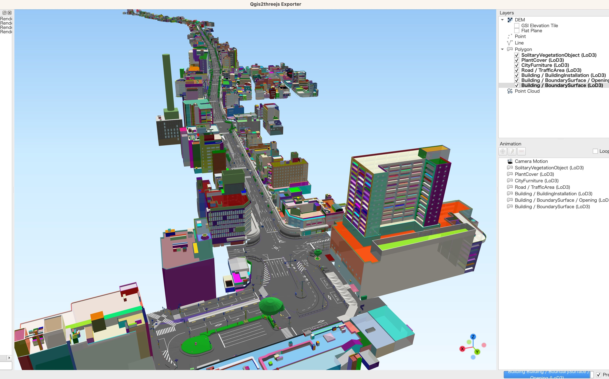

# PLATEAU QGIS Plugin

オープンソースの GIS アプリケーション [QGIS](https://www.qgis.org/) で「PLATEAU 3D 都市モデル」を読み込むためのプラグイン（ベータ版）です。PLATEAU の「3D 都市モデル標準製品仕様書 第 3.0 版」に対応した CityGML ファイルを読み込むことができます。

[静岡県沼津市の CityGML (v2)](https://www.geospatial.jp/ckan/dataset/plateau-22203-numazu-shi-2021/resource/758fe63a-b20f-4d5d-817d-c35eac530143) を読み込んで、LOD3のデータをQgis2threejsで表示した例：



## プラグインの利用方法

### 動作環境

本プラグインを利用するには、QGIS（バージョン 3.28 以上）がインストールされている必要があります。QGIS のダウンロードとインストールについては、[QGIS 公式サイトのダウンロードページ](https://qgis.org/ja/site/forusers/download.html)を参照してください。

### プラグインのインストール

本プラグインは QGIS の[公式プラグインリポジトリで公開されており](https://plugins.qgis.org/plugins/plateau_plugin/)、以下の手順で QGIS にインストールできます：

1. QGIS を起動します。
2. メニューから「プラグイン」→「プラグインの管理とインストール」を開きます。
3. プラグインの検索欄に "PLATEAU" などと入力して見つかる「PLATEAU 3D City Models」をインストールします。

詳しいインストール手順は、本プラグインの[利用マニュアル](https://github.com/Project-PLATEAU/plateau-qgis-plugin/blob/main/docs/manual.md)を参照してください。

### 利用方法

ここではシンプルな利用方法を簡単に示します。

1. QGIS の「プロセシング」メニューから「ツールボックス」を開きます。
2. プロセシングツールボックスの「Project PLATEAU」から「PLATEAU 3D 都市モデルを読み込む」を選択します。
3. 読み込みたい CityGML ファイルを指定します。
4. 必要に応じて読み込みオプションを変更します。
5. 「実行」ボタンをクリックして読み込み処理を実行します。

詳しい利用方法は本プラグインの[利用マニュアル](https://github.com/Project-PLATEAU/plateau-qgis-plugin/blob/main/docs/manual.md)を参照してください。

## 2023 年度 PLATEAU Hands-on 動画 | PLATEAU のデータを活用しよう！ 初心者向け QGIS ハンズオン


PLATEAU データを読み込むための本プラグインの使用方法や、PLATEAU データを他のオープンデータと組み合わせて解析する方法をハンズオン形式で紹介する動画です。

QGIS の基本から紹介しているため、QGIS を初めて触る方にも役立つ内容となっています。ぜひご覧ください。

- [YouTube 動画はコチラ](https://www.youtube.com/watch?v=xZCLndeT58A)
- [資料はコチラ](https://github.com/Project-PLATEAU/plateau-qgis-plugin/blob/main/docs/plateauhands-on-08.pdf)

## ライセンス

本ソフトウェアのソースコードは GPL v2 でライセンスされています。ソースコードおよび関連ドキュメントの著作権は国土交通省に帰属します。

本ソフトウェアは[株式会社MIERUNE](https://www.mierune.co.jp/)が開発しました。本リポジトリに含まれている [plateau-py](https://github.com/MIERUNE/plateau-py) は MIT ライセンスで公開しています。

本ドキュメントは Project PLATEAU のサイトポリシー（CC BY 4.0 および政府標準利用規約 2.0）に従い提供されています。

## 注意事項

- 本リポジトリは参考資料として提供しているものです。動作の保証は行っておりません。
- 本リポジトリの内容は予告なく変更・削除する場合があります。
- 本リポジトリおよび本プラグインの利用により生じた損失及び損害等について、国土交通省はいかなる責任も負わないものとします。

## 開発者向け情報

- 問題を報告したい方は GitHub の [Issue](https://github.com/MIERUNE/plateau-qgis-plugin/issues) または [Pull Request](https://github.com/MIERUNE/plateau-qgis-plugin/pulls) をご利用ください。
- QGIS 3.28 で動作させるため Python 3.9 の文法で実装する必要があります。
- PLATEAU CityGML ファイルの解析処理は [plateau-py](https://github.com/MIERUNE/plateau-py) パッケージとして分離されています。

QGIS にデプロイする:

```console
make deploy
```

最新の `plateau-py` を取り込む:

```console
make update_dependencies
```
