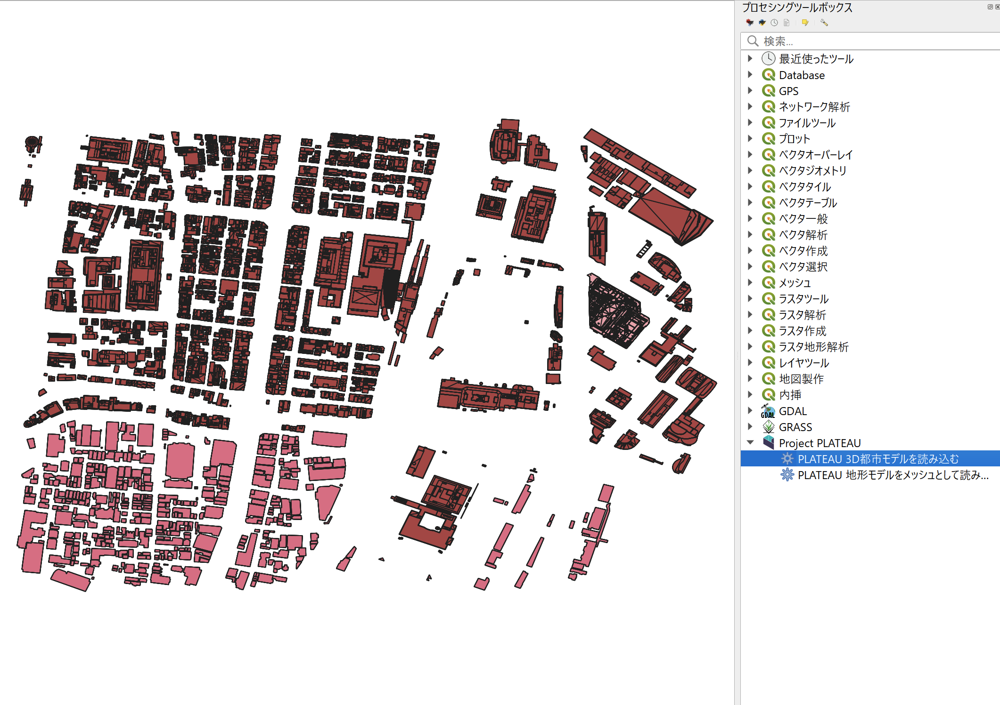
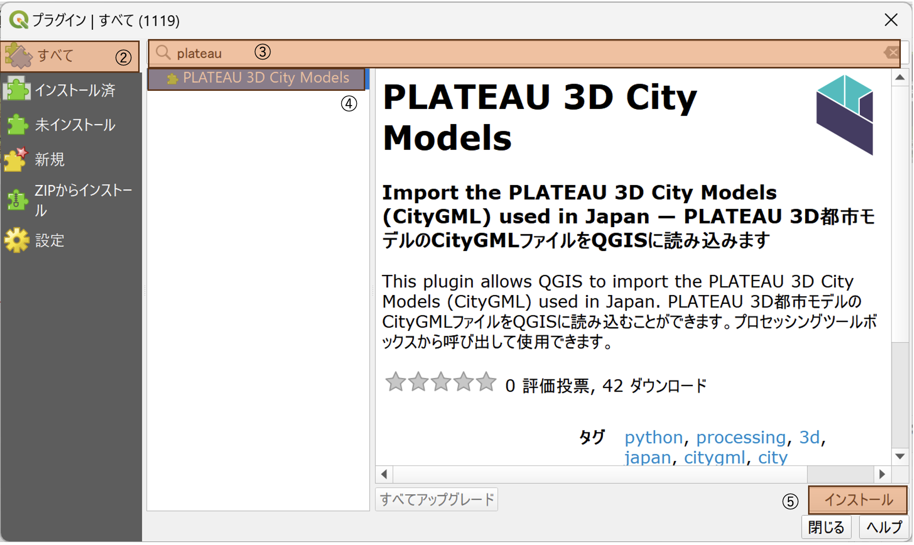

# PLATEAU 3D City Model Plugin

#### PLATEAU 地形モデル以外

#### PLATEAU 地形モデル

## はじめに
### プラグインの概要

CityGML読み込みプラグイン（PLATEAU 3D City Model Plugin、以降「本プラグイン」と呼称）は、QGISでPLATEAUのCityGMLファイルを読み込みLOD1に相当する地物をQGIS上に表示することが出来るプラグインです。データは一時スクラッチレイヤに読み込まれます。
### 対応データ形式

本プラグインでは「3D都市モデル標準製品仕様書 第3.0版」に対応するCityGMLファイルを指定する必要があります。いずれもQGIS上のベクタレイヤに変換し、データは一時スクラッチレイヤに読み込まれます。

## 動作環境

本プラグインの動作環境は以下の通りです。本プラグインを実行するには、QGIS（バージョン 3.28）がインストールされている必要があります。

OS：Windows10、Windows11（16GB以上のメモリ推奨）
QGIS：バージョン3.28
QGISのインストールについては、以下を参照ください

[QGISインストーラー](https://www.qgis.org/ja/site/forusers/alldownloads.html)

## インストール方法

本プラグインはzip圧縮されたファイルで提供します。ダウンロードしたzipファイルのインストール手順は以下の通りです。

QGISを起動
1. メニュータブの[プラグイン]から[プラグインの管理とインストール]を選択

2. 表示画面の左側のタブから[ZIPからインストール]を選択
3. 表示画面の右側の[･･･]ボタンを選択し、エクスプローラ上で本プラグインのzipファイルを選択
4. 表示画面中央の[インストール]を選択
5. メニュータブの[プラグイン]および、[プラグインツールバー]にインストールされたプラグインが表示されます。

インストールされたプラグインが表示されない場合、以下の手順によりプラグインを有効化する必要があります。

1. 表示画面の左側のタブから[インストール済]を選択
2. 本プラグイン(aggregate in buffer)左側のチェックボックスをチェック
3. 本プラグインが有効化されます。

## アンインストール方法

本プラグインのアンインストール手順は以下の通りです。

1. メニュータブの[プラグイン]から[プラグインの管理とインストール]を選択
2. 表示画面の左側のタブから[インストール済]を選択
3. 本プラグイン(PLATEAU 3D City Model Plugin)を選択
4. 表示画面右下の[アンインストール]を選択
5. 本プラグインがアンインストールされます。

## 使用方法

本プラグインはCityGMLファイルを読み込み、一時スクラッチレイヤとしてQGIS上に表示します。
変換にあたっては、「日本測地系2011における経緯度座標系と東京湾平均海面を基準とする標高の複合座標参照系（EPSG：6697）」ではQGISで適切に表示できない可能性があるため、「EPSG:6668 (JGD2011)」の緯度経度の座標参照系や、「平面直角座標系」などのメートルを距離単位とする座標参照系に変換することを推奨します。
また、以下の説明はQGISの言語設定を日本語として記載しています。

## データの準備
本プラグインにはCityGMLデータが必要です。CityGMLデータは以下のサイトからダウンロードできます。

[CityGMLデータ](https://www.geospatial.jp/ckan/dataset/plateau)

ダウンロードしたZIPファイルを解凍後に作成されるフォルダー内の「xxxxx.gml」ファイルが必要となります。

## 実行手順 (PLATEAU 地形モデル以外)

1. メニュータブの[プロセシング]から[ツールボックス]を選択、ツールボックスが表示されたら、[Project PLATEAU]をダブルクリックし、[PLATEAU 3D都市モデルを読み込む]をダブルクリックしプラグインを起動します。

2. 本プラグインの設定画面において、各項目を設定

3. 読み込み対象のCityGMLファイルを指定

4. 各地物の最高LODのみを読み込む[オプション] (デフォルトで各地物の最高LODのみを読み込む)
> 同一の都市オブジェクトに複数のLOD (詳細度) が用意されている場合は、デフォルトでは最も単純なLODのみを読み込みます。
すべてのLODを読み込みたい場合は「全てのLODを読み込む」を選択してください。

5. 地物を構成する部分ごとにレイヤを分ける[オプション]
>オプションを有効にすると、一部のモデルのLOD2以上において、壁や屋根、車道や歩道といった意味的な部分に分けて地物を読み込みます。有効にすると生成される地物の数が大幅に増える可能性があります。

6. 3次元データを強制的に2次元化する[オプション]
> オプションを有効にすると、3次元の情報を捨てて平面データとして読み込みます。高さをもたないモデル (都市計画決定情報など) はこのオプションにかかわらず常に平面として読み込みます。

7. 既存の同名レイヤに追記する[オプション] (デフォルトでチェック)
> オプションを有効にすると、既存のレイヤに追記されます。

8. 変換先CRS[オプション]
> 変換先のCRSを指定します。(デフォルトで EPSG:6668 (JGD2011))

9. ｢実行｣を押下して処理を実行
> 処理が完了すると、QGISのレイヤパネルに読み込まれたデータが表示されます。

## 実行手順 (PLATEAU 地形モデル)

1. メニュータブの[プロセシング]から[ツールボックス]を選択、ツールボックスが表示されたら、[Project PLATEAU]をダブルクリックし、[PLATEAU 地形モデルをメッシュとして読み込む]をダブルクリックしプラグインを起動します。

2. 本プラグインの設定画面において、各項目を設定

3. 読み込み対象のCityGMLファイル(地形モデル)を指定
4. 出力メッシュファイル[オプション] 
5. ｢実行｣を押下して処理を実行
> 処理が完了すると、QGISのレイヤパネルに読み込まれたデータが表示されます。

## バッチプロセスによる複数のCityGMLファイルを指定し一括読み込み
### 注意事項
バッチプロセスでは、複数のファイルを同時に読み込むと大量のメモリを消費する可能性があります。  
メモリ不足となるとプラグインの処理が止まったり、QGISがクラッシュする可能性があるため、メモリ使用量をご確認の上で実行してください。

###  バッチプロセスでの実行 (PLATEAU 地形モデル以外)

1. メニュータブの[プロセシング]から[ツールボックス]を選択、ツールボックスが表示されたら、[Project PLATEAU]をダブルクリックし、[PLATEAU 3D都市モデルを読み込む]をダブルクリックしプラグインを起動します。

2. バッチプロセスで実行をクリック

3. パラメータタブにおいて、以下の項目を読み込みたいCityGMLの数だけ設定します。

    - PLATEAU CityGMLファイル
    - 地物を構成する部分ごとにレイヤーを分ける (デフォルト いいえ)
    - 3次元データを強制的に2次元化する (デフォルト いいえ)
    - 既存の同名レイヤに追記する (デフォルト はい)
    - 変換先CRS (デフォルトで EPSG:6668 (JGD2011))

1. 完了時にレイヤーを読み込む
2. ｢実行｣を押下して処理を実行

#### オートフィル機能を使って複数のCityGMLファイルを一括読み込み

1.オートフィルを選択
2.ファイルを選択

3.フォルダーから読み込みたいCityGMLファイルを複数選択

####  フィルダウン機能を使ってオプションを一括登録
一番上の行の選択項目がすべての行に反映されます。

1.１番上の行の選択項目を設定し、オートフィルを選択
2.フィルダウンを選択

3.選択列の項目が１番目の値にすべて変更されます

###  バッチプロセスでの実行 (PLATEAU 地形モデル)

1. メニュータブの[プロセシング]から[ツールボックス]を選択、ツールボックスが表示されたら、[Project PLATEAU]をダブルクリックし、[PLATEAU 地形モデルをメッシュとして読み込む]をダブルクリックしプラグインを起動します。

2. バッチプロセスで実行をクリック

3. パラメータタブにおいて、以下の項目を読み込みたいCityGMLの数だけ設定する。

    - PLATEAU CityGMLファイル
    - 出力メッシュファイル (デフォルト空白)

1. 完了時にレイヤーを読み込む
2. ｢実行｣を押下して処理を実行

#### 上記以外にも、オートフィル機能を使って、複数のCityGMLファイルを一括読み込みすることが可能です。

1.オートフィルを選択
2.ファイルを選択

3.フォルダーから読み込みたいCityGMLファイルを複数選択

