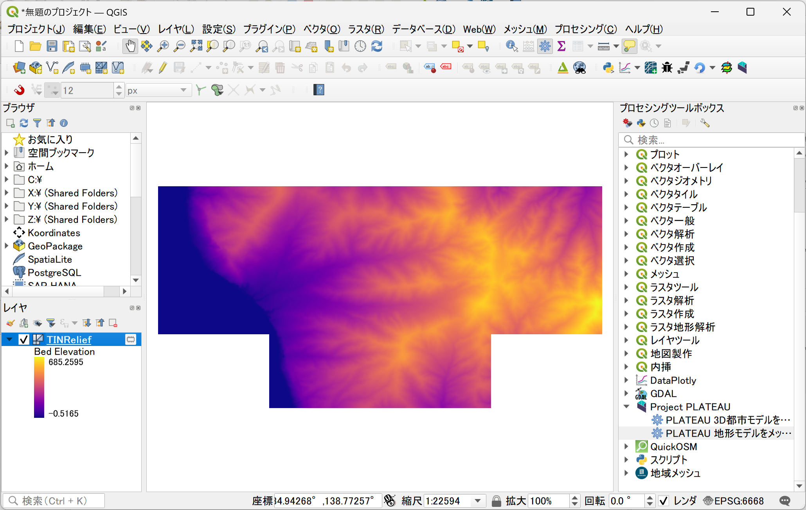
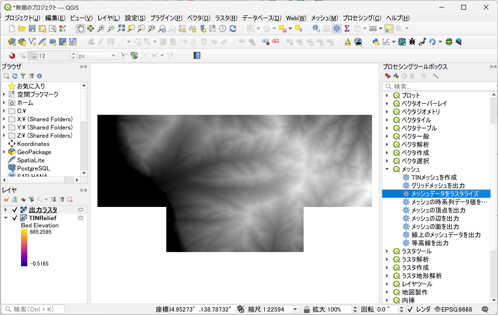

# PLATEAU 3D City Model Plugin

#### PLATEAU 地形モデル以外

#### PLATEAU 地形モデル

## はじめに
### プラグインの概要

CityGML読み込みプラグイン（PLATEAU 3D City Model Plugin、以降「本プラグイン」と呼称）は、QGISでPLATEAUのCityGMLファイルを読み込み、QGIS上に表示するためのプラグインです。データは一時スクラッチレイヤとして読み込まれます。
### 対応データ形式

本プラグインでは「3D都市モデル標準製品仕様書 第3.0版」に対応するCityGMLファイルを指定する必要があります。

## 動作環境

本プラグインの動作環境は以下の通りです。本プラグインを実行するには、QGIS（バージョン 3.28）がインストールされている必要があります。

OS：Windows10、Windows11
QGIS：バージョン3.28
QGISのインストールについては、以下を参照ください

[QGISインストーラー](https://www.qgis.org/ja/site/forusers/alldownloads.html)

## インストール方法

本プラグインはzip圧縮されたファイルで提供します。ダウンロードしたzipファイルのインストール手順は以下の通りです。

QGISを起動
1. メニュータブの[プラグイン]から[プラグインの管理とインストール]を選択します。

2. 表示画面の左側のタブから[ZIPからインストール]を選択します。
3. 表示画面の右側の[･･･]ボタンを選択し、エクスプローラ上で本プラグインのzipファイルを選択します。
4. 表示画面中央の[インストール]を選択します。
5. メニュータブの[プラグイン]および、[プラグインツールバー]にインストールされたプラグインが表示されます。

インストールされたプラグインが表示されない場合、以下の手順によりプラグインを有効化する必要があります。

1. 表示画面の左側のタブから[インストール済]を選択します。
2. 本プラグイン左側のチェックボックスをチェックします。
3. 本プラグインが有効化されます。

## アンインストール方法

本プラグインのアンインストール手順は以下の通りです。

1. メニュータブの[プラグイン]から[プラグインの管理とインストール]を選択します。
2. 表示画面の左側のタブから[インストール済]を選択します。
3. 本プラグイン(PLATEAU 3D City Model Plugin)を選択します。
4. 表示画面右下の[アンインストール]を選択します。
5. 本プラグインがアンインストールされます。

## 使用方法

本プラグインはCityGMLファイルを読み込み、一時スクラッチレイヤとしてQGIS上に表示します。
変換にあたっては、「日本測地系2011における経緯度座標系と東京湾平均海面を基準とする標高の複合座標参照系（EPSG：6697）」ではQGISで適切に表示できない可能性があるため、「EPSG:6668 (JGD2011)」の緯度経度の座標参照系や、「平面直角座標系」などのメートルを距離単位とする座標参照系に変換することを推奨します。

## データの準備
本プラグインにはCityGMLデータが必要です。CityGMLデータは以下のサイトからダウンロードできます。

[CityGMLデータ](https://www.geospatial.jp/ckan/dataset/plateau)

ダウンロードしたZIPファイルを解凍後に作成されるフォルダー内のすべてのファイルが必要となります。
なお、解凍後のフォルダ構成は変更しないようにしてください。変更すると属性が適切に読み込めないことがあります。

## 「PLATEAU 3D都市モデルを読み込む」実行手順

### 実行手順

1. メニュータブの[プロセシング]から[ツールボックス]を選択、ツールボックスが表示されたら、[Project PLATEAU]をダブルクリックし、[PLATEAU 3D都市モデルを読み込む]をダブルクリックしプラグインを起動します。

2. 本プラグインの設定画面において、各項目を設定します。

3. PLATEAU CityGMLファイル
> 読み込み対象のCityGMLファイルを指定します。

4. 読み込むLOD
> 同一の都市オブジェクトに複数のLOD (詳細度) が用意されている場合は、デフォルトでは最も単純なLODのみを読み込みます。目的に応じて選択してください。

5. 地物を構成する部分ごとにレイヤを分ける[オプション]
>オプションを有効にすると、一部のモデルのLOD2以上において、壁や屋根、車道や歩道といった意味的な部分に分けて地物を読み込みます。有効にすると生成される地物の数が大幅に増える可能性があります。

6. 3次元データを強制的に2次元化する[オプション]
> オプションを有効にすると、3次元の情報を捨てて平面データとして読み込みます。高さをもたないモデル (都市計画決定情報など) はこのオプションにかかわらず常に平面として読み込みます。

7. 既存の同名レイヤに追記する[オプション] (デフォルトでチェック)
> オプションを有効にすると、既存のレイヤに追記されます。

8. 変換先CRS[オプション]
> 変換先のCRSを指定します。(デフォルトではEPSG:6668 (JGD2011))

9. [実行]を押下して処理を実行
> ｢実行｣を押下すると処理が開始します。処理が完了すると、QGISのレイヤパネルに読み込まれたデータが表示されます。

### 災害リスク情報の取り扱い
災害リスク情報を持つ建築物モデルを読み込むと、建築物モデルとは別のレイヤ（テーブル形式のレイヤ）として出力されます。
このレイヤは、災害リスク情報が持つ属性である[description]と[scale]の単位で分割して出力されます。

- description
    - 災害リスク情報の属性を付与する元となる図又はデータの名称。
- scale
    - 洪水浸水想定区域内に存在する建築物に、浸水想定区域がもつ属性を与える際に、想定最大規模降雨あるいは計画規模降雨のいずれにより作成されたかの区分。

「3D都市モデル（Project PLATEAU）沼津市（2021年度）」CityGML（v2）の建築物モデルを読み込んだ例

#### 建築物モデルに災害リスク情報を付与する手順
災害リスク情報を建築物モデルを付与するためには、以下の手順を実行します。

1. レイヤパネルより、[Building]レイヤを右クリックして、[プロパティ]を選択します。

2. 左のタブより[テーブル結合]を選択します。
3. 下部より[+]ボタンをクリックします。

4. プルダウンで以下の通り選択します。
    - [結合するレイヤ]には、建築物モデルに付与したい災害リスク情報のレイヤを選択
    - [結合基準の属性]には、[parent]を選択
    - [ターゲット属性]には、[id]を選択

5. オプションで[属性名の接頭辞]にチェックを入れて、値を適宜修正します。
6. [OK]をクリックします。

7. 設定した内容が登録されていることを確認します。
8. [適用]をクリックしてから、[OK]をクリックします。

9. レイヤパネルより、[Building]レイヤを右クリックして、[属性テーブルを開く]を選択します。

10. 属性テーブルの右側に、5で設定した[属性名の接頭辞]+ [災害リスク情報の属性名]の名称で、属性が付与されていることを確認します。

## 「PLATEAU 地形モデルをメッシュとして読み込む」実行手順

### 実行手順
1. メニュータブの[プロセシング]から[ツールボックス]を選択、ツールボックスが表示されたら、[Project PLATEAU]をダブルクリックし、[PLATEAU 地形モデルをメッシュとして読み込む]をダブルクリックしプラグインを起動します。

2. 本プラグインの設定画面において、各項目を設定します。

3. PLATEAU CityGMLファイル
> 読み込み対象のCityGMLファイル(地形モデル)を指定します。

4. 出力メッシュファイル[オプション] 
> 出力するフォルダを指定します。指定しない場合は、一時スクラッチレイヤとして読み込まれます。

5. [実行]を押下して処理を実行
> 処理が完了すると、QGISのレイヤパネルに読み込まれたデータが表示されます。

### メッシュをラスタライズする手順
地形モデルはメッシュレイヤとして出力されます。ラスタに変換したい場合は、以下の手順を実行します。

1. メニュータブの[プロセシング]から[ツールボックス]を選択、ツールボックスが表示されたら、[メッシュ]をダブルクリックし、[メッシュデータをラスタライズ]をダブルクリックしプラグインを起動します。

2. 設定画面において、各項目を設定します。

3. 入力メッシュ
> [TINRelief（プラグインでインポートした地形モデルを選択）]を設定します。

4. データセットグループ
> 右の[…]より[現在アクディブなデータセットグループ]を設定

5. ピクセルサイズ
> ラスタのピクセルサイズを設定します。地形モデルは緯度経度のデータとして作成されているため、約10m（0.4秒）のラスタを作成する場合は[0.00011111]を入力します（1 / 60 / 60 * 0.4 = 0.00011111度）。

6. [出力ラスタ]
出力するフォルダを指定します。指定しない場合は、一時スクラッチレイヤとして読み込まれます。

7. [実行]を押下して処理を実行
> 処理が完了すると、QGISのレイヤパネルに読み込まれたデータが表示されます。

## バッチプロセスによる複数のファイルの一括読み込み
### 注意事項
バッチプロセスで複数のファイルを同時に読み込むと大量のメモリを消費する可能性があります。  
メモリ不足となるとQGISがクラッシュする可能性があるため、メモリ使用量をご確認の上で実行してください。

###  「PLATEAU 3D都市モデルを読み込む」バッチプロセスでの実行

1. メニュータブの[プロセシング]から[ツールボックス]を選択、ツールボックスが表示されたら、[Project PLATEAU]をダブルクリックし、[PLATEAU 3D都市モデルを読み込む]をダブルクリックしプラグインを起動します。

2. [バッチプロセスで実行]をクリック

3. パラメータタブにおいて、以下の項目を読み込みたいCityGMLの数だけ設定します。

    - PLATEAU CityGMLファイル
    - 地物を構成する部分ごとにレイヤーを分ける (デフォルト いいえ)
    - 3次元データを強制的に2次元化する (デフォルト いいえ)
    - 既存の同名レイヤに追記する (デフォルト はい)
    - 変換先CRS (デフォルトで EPSG:6668 (JGD2011))

4. 完了時にレイヤを読み込む
> チェックを入れます。

5. ｢実行｣を押下して処理を実行
> 処理が完了すると、QGISのレイヤパネルに読み込まれたデータが表示されます。

#### オートフィル機能を使って複数のCityGMLファイルを一括読み込み

1.[オートフィル]を選択します。
2.[ファイル]を選択します。

3.フォルダーから読み込みたいCityGMLファイルを複数選択します。

####  フィルダウン機能を使ってオプションを一括登録
一番上の行の選択項目がすべての行に反映されます。

1.１番上の行の選択項目を設定し、[オートフィル]を選択します。
2.[フィルダウン]を選択します。

3.選択列の項目が１番目の値にすべて変更されます。

###  「PLATEAU 地形モデルをメッシュとして読み込む」バッチプロセスでの実行

1. メニュータブの[プロセシング]から[ツールボックス]を選択し、ツールボックスが表示されたら、[Project PLATEAU]をダブルクリックし、[PLATEAU 地形モデルをメッシュとして読み込む]をダブルクリックしプラグインを起動します。

2. [バッチプロセスで実行]をクリックします。

3. パラメータタブにおいて、以下の項目を読み込みたいCityGMLの数だけ設定します。

    - PLATEAU CityGMLファイル
    - 出力メッシュファイル (デフォルト空白)

4. 完了時にレイヤを読み込む
> チェックを入れます。

5.  [実行]を押下して処理を実行
> 処理が完了すると、QGISのレイヤパネルに読み込まれたデータが表示されます。

#### オートフィル機能を使って、複数のCityGMLファイルを一括読み込み

1.[オートフィル]を選択します。
2.[ファイル]を選択します。

3.フォルダーから読み込みたいCityGMLファイルを複数選択します。

