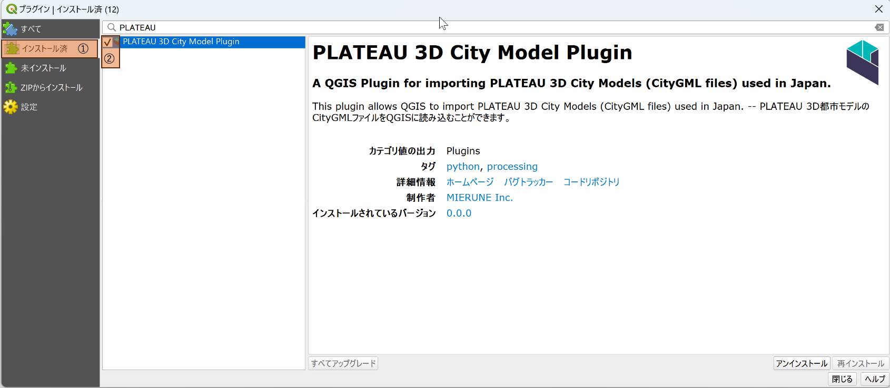

# PLATEAU 3D City Model Plugin
このプラグインはQGIS上でCityGMLを読み込みLOD1の地物を読み込むためのQGIS用プラグインです。

## はじめに

### プラグインの概要

CityGMLを読み込みプラグイン（PLATEAU 3D City Model Plugin、以降「本プラグイン」と呼称）は、QGIS上でCityGMLファイルを読み込みLOD1に相当する地物をQGIS上に表示することが出来るプラグインです。データは一時スクラッチレイヤに読み込まれます。

### 対応データ形式

本プラグインではCityGMLファイルを指定する必要があります。いずれもQGIS上のベクタレイヤに変換し、データは一時スクラッチレイヤに読み込まれます。

## 動作環境

本プラグインの動作環境は以下の通りです。本プラグインを実行するには、QGIS（バージョン 3.28 以上）がインストールされている必要があります。

OS：Windows10
QGIS：バージョン3.28以上
QGISのインストールについては、以下を参照ください

QGISインストーラー

## インストール方法

本プラグインはzip圧縮されたファイル「xxxxxxxxxxx.zip」で提供します。ダウンロードしたzipファイルのインストール手順は以下の通りです。

QGISを起動
1. メニュータブの[プラグイン]から[プラグインの管理とインストール]を選択
2. 表示画面の左側のタブから[ZIPからインストール]を選択
3. 表示画面の右側の[･･･]ボタンを選択し、エクスプローラ上で本プラグインのzipファイルを選択
4. 表示画面中央の[インストール]を選択
5. メニュータブの[プラグイン]および、[プラグインツールバー]にインストールされたプラグインが表示されます。

インストールされたプラグインが表示されない場合、以下の手順によりプラグインを有効化する必要があります。

1. メニュータブの[プラグイン]から[プラグインの管理とインストール]を選択
2. 表示画面の左側のタブから[インストール済]を選択
3. 本プラグイン(aggregate in buffer)左側のチェックボックスをチェック
4. 本プラグインが有効化されます

## アンインストール方法

本プラグインのアンインストール手順は以下の通りです。

1. メニュータブの[プラグイン]から[プラグインの管理とインストール]を選択
2. 表示画面の左側のタブから[インストール済]を選択
3. 本プラグイン(PLATEAU 3D City Model Plugin)を選択
4. 表示画面右下の[アンインストール]を選択
5. 本プラグインがアンインストールされます

## 使用方法

本プラグインの実行方法を説明します。以下、QGISの言語設定は日本語として記載します。バージョンにより文言が異なる場合があることに留意ください。
本プラグインの実行にあたっては、レイヤのCRS（座標参照系）について、平面直角座標系などのメートルを距離単位とするものに変換することを推奨します。
CityGMLファイルを読み込み、ポリゴンレイヤとしてQGIS上に表示できます。

## データの準備
本プラグインにはCityGMLデータが必要です。CityGMLデータは以下のサイトからダウンロードできます。
<URL>
ダウンロードしたZIPファイルを解凍後に作成されるフォルダー内の「xxxxx.gml」ファイルが必要となります。

## 実行手順 (PLATEAU 地形モデル以外)

1. メニュータブの[プロセシング]から[ツールボックス]を選択、ツールボックスが表示されたら、[Project PLATEAU]をダブルクリックし、[PLATEAU 3D都市モデルを読み込む]をダブルクリックしプラグインを起動する。

2. 本プラグインの設定画面において、各項目を設定

3. 読み込み対象のCityGMLファイルを指定
4. 各地物の最高LODのみを読み込む[オプション] (デフォルトでチェック)
> 同一の都市オブジェクトに複数のLOD (詳細度) が用意されている場合は、デフォルトでは最も詳細なLODのみを読み込みます。
すべてのLODを読み込みたい場合は「各地物の最高 LOD のみを読み込む」オプションを無効にしてください。

5. 意味的な子要素に分ける[オプション]
>オプションを有効にすると、一部のモデルのLOD2以上において、壁や屋根、車道や歩道といった意味的な部分に分けて地物を読み込みます。有効にすると生成される地物の数が大幅に増える可能性があります。

6. 3次元データを強制的に2次元化する[オプション]

> オプションを有効にすると、3次元の情報を捨てて平面データとして読み込みます。高さをもたないモデル (都市計画決定情報など) はこのオプションにかかわらず常に平面として読み込みます。

7. 変換先CRS[オプション]
> 変換先のCRSを指定します。(デフォルトで EPSG:4326 (WGS84))

8. ｢実行｣を押下して処理を実行
> 処理が完了すると、QGISのレイヤパネルに読み込まれたデータが表示されます。

## 実行手順 (PLATEAU 地形モデル)

1. メニュータブの[プロセシング]から[ツールボックス]を選択、ツールボックスが表示されたら、[Project PLATEAU]をダブルクリックし、[PLATEAU 地形モデルをメッシュとして読み込む]をダブルクリックしプラグインを起動する。

2. 本プラグインの設定画面において、各項目を設定

3. 読み込み対象のCityGMLファイル(地形モデル)を指定
4. 出力メッシュファイル[オプション] 
5. ｢実行｣を押下して処理を実行
> 処理が完了すると、QGISのレイヤパネルに読み込まれたデータが表示されます。

##  バッチプロセスでの実行 (PLATEAU 地形モデル以外)

本プラグインは個別のCityGMLファイルを読み込む方法の他にバッチプロセスによる複数のCityGMLファイルを指定しての一括読み込みが可能です。

1. メニュータブの[プロセシング]から[ツールボックス]を選択、ツールボックスが表示されたら、[Project PLATEAU]をダブルクリックし、[PLATEAU 3D都市モデルを読み込む]をダブルクリックしプラグインを起動する。

2. バッチプロセスで実行をクリック

3. パラメータタブにおいて、以下の項目を読み込みたいCityGMLの数だけ設定する。

    - PLATEAU CityGMLファイル
    - 各地物の最高LODのみを読み込む (デフォルトYes)
    - 意味的な子要素に分ける (デフォルトNo)
    - 3次元データを強制的に2次元化する (デフォルトNo)
    - 変換先CRS ((デフォルトで EPSG:4326 (WGS84)))

4. 完了時にレイヤーを読み込む
5. ｢実行｣を押下して処理を実行

